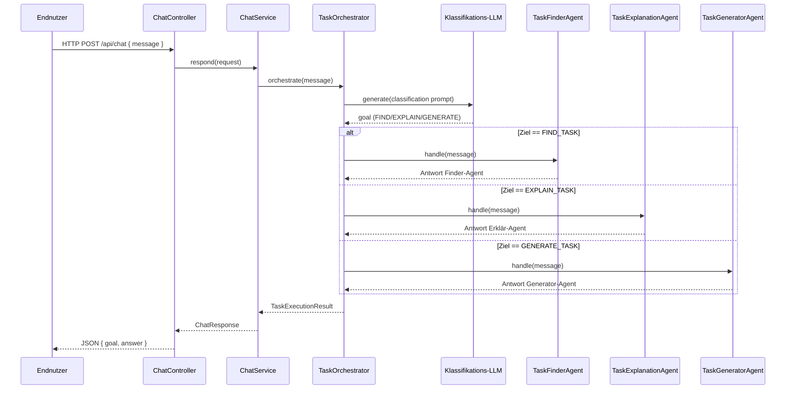

# GRETL Copilot Skeleton

Dieses Projekt liefert ein minimales, aber lauffähiges Spring-Boot-Skeleton für einen GRETL Copilot auf Basis von [LangChain4j](https://github.com/langchain4j/langchain4j). Der Fokus liegt auf der Orchestrierung unterschiedlicher Sub-Agents ("Task finden", "Task erklären", "Task generieren") durch einen zentralen Orchestrator-Agenten, der die Benutzeranfrage per LLM klassifiziert und die passende Fähigkeit aufruft.

## Architekturüberblick



## Klassenübersicht

### Laufzeitstart & Konfiguration

#### `ch.so.agi.gretl.copilot.GretlCopilotApplication`
Spring-Boot-Einstiegspunkt, der den Application Context startet und damit REST-API, WebFlux-Stack und LangChain4j-Konfiguration verfügbar macht.

#### `ch.so.agi.gretl.copilot.config.LangChainConfiguration`
Deklariert separate `ChatModel`-Beans für Klassifizierung, Finden, Erklären und Generieren.
* Über Properties (`openai.classifier-model`, `openai.finder-model`, `openai.explanation-model`, `openai.generator-model`) lassen sich je Ziel unterschiedliche Modelle konfigurieren.
* Bei fehlendem API-Key greifen Fallbacks: ein Keyword-basierter Klassifizierer sowie drei Prefix-Mockmodelle, die lokal sofort Antworten erzeugen.

### REST & Service-Layer

#### `ch.so.agi.gretl.copilot.chat.ChatController`
REST-Controller für `POST /api/chat`. Validiert den Payload, delegiert an den Service und liefert strukturierte JSON-Antworten für externe Integrationen.

#### `ch.so.agi.gretl.copilot.chat.ChatService`
Zwischenschicht, die den Orchestrator kapselt. Neben der synchronen Methode `respond` stellt `respondReactive` ein reaktives `Mono` bereit, auf dem sowohl REST als auch SSE-UI aufbauen.

#### `ch.so.agi.gretl.copilot.chat.dto.ChatRequest`
Input-DTO mit `@NotBlank`-Validierung, damit nur echte Chatnachrichten verarbeitet werden.

#### `ch.so.agi.gretl.copilot.chat.dto.ChatResponse`
Output-DTO, das das gewählte Ziel (`TaskType`) und die generierte Antwort an Client oder Frontend liefert.

### Web-UI & Streaming

#### `ch.so.agi.gretl.copilot.chat.ui.ChatUiController`
Rendern der JTE-Oberfläche (`GET /ui/chat`) und Bearbeiten der von HTMX ausgelösten Form-Posts. Rückgabe eines HTML-Snippets für die Benutzer-Nachricht und Start der reaktiven Antwortverarbeitung pro Client.

#### `ch.so.agi.gretl.copilot.chat.ui.ChatStreamController`
SSE-Endpunkt `GET /ui/chat/stream/{clientId}`. Stellt pro Browser-Verbindung einen Flux bereit, der Bot-Antworten live in die Oberfläche streamt.

#### `ch.so.agi.gretl.copilot.chat.ui.ChatViewRenderer`
Hilfsklasse zum Rendern einzelner Nachrichten via JTE. Sie stellt sicher, dass identische Templates für Initial-HTML, HTMX-Snippets und SSE-Nachrichten genutzt werden.

#### `ch.so.agi.gretl.copilot.chat.stream.ChatStreamPublisher`
Verwaltet reaktive `Sinks.Many` je Client-ID. Controller registrieren/abmelden Streams, während Service und UI neue Nachrichten als HTML-Strings publizieren.

#### `ch.so.agi.gretl.copilot.chat.view.ChatMessageView`
Value-Objekt für die Templates. Enthält Autor, Anzeigeüberschrift und CSS-Klasse und bietet Factory-Methoden für User-, Assistant- und Systemmeldungen.

#### `ch.so.agi.gretl.copilot.chat.view.ChatMessageAuthor`
Enum mit Metadaten (Anzeige-Name, CSS-Klasse) zu den verschiedenen Quellen einer Nachricht. Wird von `ChatMessageView` und den Templates genutzt.

### Orchestrierung & Agents

#### `ch.so.agi.gretl.copilot.orchestration.TaskType`
Enum für die Ziele `FIND_TASK`, `EXPLAIN_TASK`, `GENERATE_TASK`. Die Methode `fromModelResponse` wählt robust den passenden Wert aus einer LLM-Antwort.

#### `ch.so.agi.gretl.copilot.orchestration.TaskAgent`
Funktionales Interface, das den Vertrag der Sub-Agenten definiert (`handle(String userMessage)` → Antworttext).

#### `ch.so.agi.gretl.copilot.orchestration.agent.TaskFinderAgent`
Mock für die Fähigkeit "Task finden". Auskommentierte Konstruktoren zeigen, wie später ein spezialisiertes `finderModel` injiziert werden kann.

#### `ch.so.agi.gretl.copilot.orchestration.agent.TaskExplanationAgent`
Mock für die Fähigkeit "Task erklären" mit vorbereiteter Injektion des `explanationModel`.

#### `ch.so.agi.gretl.copilot.orchestration.agent.TaskGeneratorAgent`
Mock für die Fähigkeit "Task generieren" samt Platzhalter für das `generatorModel`.

#### `ch.so.agi.gretl.copilot.orchestration.TaskExecutionResult`
Record, der den ausgewählten `TaskType` und die Agentenantwort bündelt. Dient als Transferobjekt zwischen Orchestrator und Service/UI.

#### `ch.so.agi.gretl.copilot.orchestration.TaskOrchestrator`
Steuert den Gesamtfluss: baut den Klassifikationsprompt, ruft das Klassifikations-LLM auf, interpretiert das Ergebnis und delegiert an den passenden Sub-Agenten.

## Tests

Das Projekt enthält mehrere Beispiel-Testklassen:
* `TaskOrchestratorTest` prüft das Routing-Verhalten des Orchestrators mithilfe eines stub-basierten `ChatModel`.
* `ChatControllerTest` stellt sicher, dass der REST-Endpunkt eine valide JSON-Antwort zurückliefert.
* `ChatStreamPublisherTest` verifiziert, dass registrierte SSE-Streams Payloads zuverlässig erhalten.
* `ChatUiIntegrationTest` startet den Webserver inkl. HTMX/JTE-Oberfläche, prüft das ausgelieferte HTML und testet den kompletten Roundtrip (Form-Submit + SSE).

Tests lassen sich mit dem Gradle Wrapper ausführen:

```bash
./gradlew test
```

## Konfiguration

1. Java 21 installieren (bereits im Gradle Toolchain konfiguriert).
2. Optional: OpenAI API-Key setzen, z. B. via `application.properties`:
   ```properties
   openai.api-key=sk-...
   openai.model=gpt-4o-mini
   ```
   * Standardmäßig ist `gg.jte.developmentMode=true` gesetzt, damit Templates ohne Precompiling sofort geladen werden. Für produktive Deployments kann auf vorcompilierte Templates umgestellt werden (`gg.jte.usePrecompiledTemplates=true`).
3. Anwendung starten:
   ```bash
   ./gradlew bootRun
   ```
4. Beispiel-Request:
   ```bash
   curl -X POST http://localhost:8080/api/chat \
        -H 'Content-Type: application/json' \
        -d '{"message": "Kannst du mir einen Task generieren?"}'
   ```

5. Web-Oberfläche:
   * Browser öffnen und `http://localhost:8080/ui/chat` aufrufen.
   * Das Formular verwendet [HTMX 2.0.8](https://htmx.org) und Server-Sent-Events, um Antworten ohne JavaScript-Framework live einzublenden.
   * Ohne OpenAI-Key greifen die Mock-Modelle und liefern Dummy-Antworten, sodass die UI auch offline nutzbar bleibt.

## Weiteres Vorgehen

* Die drei Sub-Agenten können nach Bedarf durch echte Implementierungen ersetzt werden (z. B. weitere LLMs, Tools oder Datenbankabfragen).
* Für die Produktionsreife empfiehlt sich eine Persistenz der Konversationen, Observability (Logging/Tracing) und eine sichere Verwaltung der API-Keys (z. B. via Spring Cloud Config oder HashiCorp Vault).
