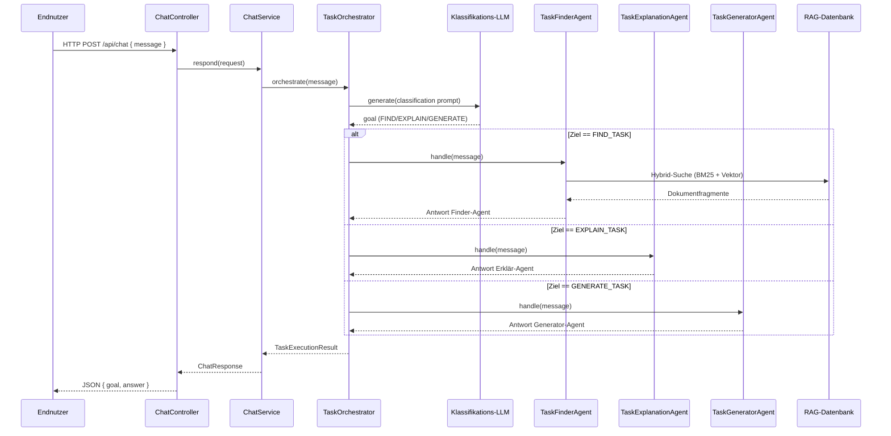

# GRETL Copilot Agent

Dieses Projekt stellt einen funktionsreichen Spring-Boot-Agenten für GRETL auf Basis von [LangChain4j](https://github.com/langchain4j/langchain4j) bereit. Der Fokus liegt auf der Orchestrierung unterschiedlicher Sub-Agents ("Task finden", "Task erklären", "Task generieren") durch einen zentralen Orchestrator-Agenten, der die Benutzeranfrage per LLM klassifiziert und die passende Fähigkeit aufruft.

## Architekturüberblick



## Klassenübersicht

### Laufzeitstart & Konfiguration

#### `ch.so.agi.gretl.copilot.GretlCopilotApplication`
Spring-Boot-Einstiegspunkt, der den Application Context startet und damit REST-API und LangChain4j-Konfiguration verfügbar macht.

#### `ch.so.agi.gretl.copilot.config.LangChainConfiguration`
Deklariert separate `ChatModel`-Beans für Klassifizierung, Finden, Erklären und Generieren.
* Über Properties (`openai.classifier-model`, `openai.finder-model`, `openai.explanation-model`, `openai.generator-model`) lassen sich je Ziel unterschiedliche Modelle konfigurieren.
* Bei fehlendem API-Key greifen Fallbacks: ein Keyword-basierter Klassifizierer sowie drei Prefix-Mockmodelle, die lokal sofort Antworten erzeugen.

### REST & Service-Layer

#### `ch.so.agi.gretl.copilot.chat.ChatController`
REST-Controller für `POST /api/chat`. Validiert den Payload, delegiert an den Service und liefert strukturierte JSON-Antworten für externe Integrationen.

#### `ch.so.agi.gretl.copilot.chat.ChatService`
Zwischenschicht, die den Orchestrator kapselt und synchron über `respond` Antworten liefert.

#### `ch.so.agi.gretl.copilot.chat.dto.ChatRequest`
Input-DTO mit `@NotBlank`-Validierung, damit nur echte Chatnachrichten verarbeitet werden.

#### `ch.so.agi.gretl.copilot.chat.dto.ChatResponse`
Output-DTO, das das gewählte Ziel (`TaskType`) und die generierte Antwort an Client oder Frontend liefert.

### Web-UI & Streaming

#### `ch.so.agi.gretl.copilot.chat.ui.ChatUiController`
Rendern der JTE-Oberfläche (`GET /ui/chat`) und Bearbeiten der von HTMX ausgelösten Form-Posts. Rückgabe eines HTML-Snippets für die Benutzer-Nachricht und Start einer asynchronen Verarbeitung pro Client, die das Ergebnis per SSE ausliefert.

#### `ch.so.agi.gretl.copilot.chat.ui.ChatStreamController`
SSE-Endpunkt `GET /ui/chat/stream/{clientId}`. Stellt pro Browser-Verbindung einen `SseEmitter` bereit, der Bot-Antworten live in die Oberfläche streamt.

#### `ch.so.agi.gretl.copilot.chat.ui.ChatViewRenderer`
Hilfsklasse zum Rendern einzelner Nachrichten via JTE. Sie stellt sicher, dass identische Templates für Initial-HTML, HTMX-Snippets und SSE-Nachrichten genutzt werden.

#### `ch.so.agi.gretl.copilot.chat.stream.ChatStreamPublisher`
Verwaltet `SseEmitter` je Client-ID. Controller registrieren/abmelden Streams, während Service und UI neue Nachrichten als HTML-Strings publizieren.

#### `ch.so.agi.gretl.copilot.chat.view.ChatMessageView`
Value-Objekt für die Templates. Enthält Autor, Anzeigeüberschrift und CSS-Klasse und bietet Factory-Methoden für User-, Assistant- und Systemmeldungen.

#### `ch.so.agi.gretl.copilot.chat.view.ChatMessageAuthor`
Enum mit Metadaten (Anzeige-Name, CSS-Klasse) zu den verschiedenen Quellen einer Nachricht. Wird von `ChatMessageView` und den Templates genutzt.

### Orchestrierung & Agents

#### `ch.so.agi.gretl.copilot.orchestration.TaskType`
Enum für die Ziele `FIND_TASK`, `EXPLAIN_TASK`, `GENERATE_TASK`. Die Methode `fromModelResponse` wählt robust den passenden Wert aus einer LLM-Antwort.

#### `ch.so.agi.gretl.copilot.orchestration.TaskAgent`
Funktionales Interface, das den Vertrag der Sub-Agenten definiert (`handle(String userMessage)` → Antworttext).

#### `ch.so.agi.gretl.copilot.orchestration.agent.TaskFinderAgent`
Führt eine hybride Suche in der RAG-Datenbank durch: BM25-/TSVektor-Abfragen liefern präzise Texttreffer, pgvector-Suche ergänzt semantisch ähnliche Chunks. Die Ergebnisse werden normalisiert, gewichtet (60 % BM25, 40 % Semantik) und als kompakte Trefferliste für die Benutzer:innen formatiert.

#### `ch.so.agi.gretl.copilot.orchestration.agent.TaskExplanationAgent`
Mock für die Fähigkeit "Task erklären" mit vorbereiteter Injektion des `explanationModel`.

#### `ch.so.agi.gretl.copilot.orchestration.agent.TaskGeneratorAgent`
Mock für die Fähigkeit "Task generieren" samt Platzhalter für das `generatorModel`.

#### `ch.so.agi.gretl.copilot.orchestration.TaskExecutionResult`
Record, der den ausgewählten `TaskType` und die Agentenantwort bündelt. Dient als Transferobjekt zwischen Orchestrator und Service/UI.

#### `ch.so.agi.gretl.copilot.orchestration.TaskOrchestrator`
Steuert den Gesamtfluss: baut den Klassifikationsprompt, ruft das Klassifikations-LLM auf, interpretiert das Ergebnis und delegiert an den passenden Sub-Agenten.

### Hybrid-Suche des TaskFinderAgent

Der Finder-Agent kombiniert zwei gezielte Abfragen auf der Tabelle `rag.doc_chunks`:

**Lexikalische Suche**

```sql
WITH query AS (
    SELECT plainto_tsquery('simple', :query) AS tsq
)
SELECT
    dc.task_name,
    ts_rank_cd(
        to_tsvector('simple', COALESCE(dc.heading, '') || ' ' || COALESCE(dc.content_text, '')),
        query.tsq
    ) AS lexical_score
FROM rag.doc_chunks dc
CROSS JOIN query
WHERE dc.content_text IS NOT NULL
  AND query.tsq @@ to_tsvector('simple', COALESCE(dc.heading, '') || ' ' || COALESCE(dc.content_text, ''))
ORDER BY lexical_score DESC
LIMIT :limit;
```

**Semantische Suche**

```sql
WITH query AS (
    SELECT CAST(:embedding AS vector) AS embedding
)
SELECT
    dc.task_name,
    1.0 / (1.0 + (dc.embedding <=> query.embedding)) AS semantic_score
FROM rag.doc_chunks dc
CROSS JOIN query
WHERE dc.embedding IS NOT NULL
ORDER BY dc.embedding <=> query.embedding ASC
LIMIT :limit;
```

* **BM25/TSVektor:** `ts_rank_cd` approximiert BM25 und liefert robuste Volltexttreffer.
* **Semantik:** Die pgvector-Distanz `(embedding <=> query.embedding)` verwandeln wir in eine Ähnlichkeitskennzahl (`1 / (1 + distance)`), um semantische Nähe zu berücksichtigen.
* **Fusion:** Die Ergebnisse werden in Java normalisiert (max-basierte Skalierung) und mit 60 % Gewicht für BM25 sowie 40 % für die semantische Komponente zusammengeführt.
* **Fallback:** Ist kein Embedding-Modell konfiguriert, arbeitet der Agent automatisch rein lexical.

**Warum `rag.doc_chunks`?** Die Tabelle enthält bereits normalisierte Dokumentfragmente inklusive Überschriften, URLs, Anker und – entscheidend – denselben `content_text`, der als Volltextbasis dient, sowie die zugehörigen Embeddings. Andere Tabellen des Schemas sind stärker spezialisiert: `rag.pages` hält lediglich Metadaten zu den Ursprungsseiten ohne Embeddings, `rag.task_properties` und `rag.task_examples` modellieren Parameter beziehungsweise Beispielcode. Für eine konsistente Hybrid-Suche benötigen wir jedoch eine Quelle, die sowohl den Suchtext als auch den Vektorraum gemeinsam vorhält. Dadurch reicht ein Tabellenzugriff aus, um beide Signale zu ermitteln, und die Treffer lassen sich unmittelbar auf konkrete Dokumentabschnitte referenzieren.

**Intent-Classifier?** Nicht nötig: Der bestehende Orchestrator klassifiziert jede Nutzeranfrage bereits in `FIND_TASK`, `EXPLAIN_TASK` oder `GENERATE_TASK`. Ein zusätzlicher Intent-Classifier im Finder würde nur Duplikatlogik einführen.

**Reranking?** Ebenfalls nicht erforderlich. Die Hybrid-Gewichtung übernimmt ein leichtgewichtiges Re-Ranking im Agenten selbst. Zusätzliche Re-Ranking-Modelle (z. B. Cross-Encoder) würden die Antwortzeit deutlich erhöhen, ohne den Nutzen bei der kompakten Top-5-Liste signifikant zu steigern.

## Tests

Das Projekt enthält mehrere Beispiel-Testklassen:
* `TaskOrchestratorTest` prüft das Routing-Verhalten des Orchestrators mithilfe eines stub-basierten `ChatModel`.
* `ChatControllerTest` stellt sicher, dass der REST-Endpunkt eine valide JSON-Antwort zurückliefert.
* `ChatStreamPublisherTest` verifiziert, dass registrierte SSE-Streams Payloads zuverlässig erhalten.
* `ChatUiIntegrationTest` startet den Webserver inkl. HTMX/JTE-Oberfläche, prüft das ausgelieferte HTML und testet den kompletten Roundtrip (Form-Submit + SSE).

Tests lassen sich mit dem Gradle Wrapper ausführen:

```bash
./gradlew test
```

## Konfiguration

1. Java 21 installieren (bereits im Gradle Toolchain konfiguriert).
2. Optional: OpenAI API-Key setzen, z. B. via `application.properties` oder als Umgebungsvariable `OPENAI_API_KEY`:
   ```properties
   openai.api-key=sk-...
   openai.model=gpt-4o-mini
   ```
   * Standardmäßig ist `gg.jte.developmentMode=true` gesetzt, damit Templates ohne Precompiling sofort geladen werden. Für produktive Deployments kann auf vorcompilierte Templates umgestellt werden (`gg.jte.usePrecompiledTemplates=true`).
3. Anwendung starten:
   ```bash
   ./gradlew bootRun
   ```
4. Beispiel-Request:
   ```bash
   curl -X POST http://localhost:8080/api/chat \
        -H 'Content-Type: application/json' \
        -d '{"message": "Kannst du mir einen Task generieren?"}'
   ```

5. Web-Oberfläche:
   * Browser öffnen und `http://localhost:8080/ui/chat` aufrufen.
   * Das Formular verwendet [HTMX 2.0.8](https://htmx.org) und Server-Sent-Events, um Antworten ohne JavaScript-Framework live einzublenden.
   * Ohne OpenAI-Key greifen die Mock-Modelle und liefern Dummy-Antworten, sodass die UI auch offline nutzbar bleibt. Fehlt der Umgebungswert, bleibt die Property leer und es ist keine zusätzliche Konfiguration nötig.

## Weiteres Vorgehen

* Die drei Sub-Agenten können nach Bedarf durch echte Implementierungen ersetzt werden (z. B. weitere LLMs, Tools oder Datenbankabfragen).
* Für die Produktionsreife empfiehlt sich eine Persistenz der Konversationen, Observability (Logging/Tracing) und eine sichere Verwaltung der API-Keys (z. B. via Spring Cloud Config oder HashiCorp Vault).
